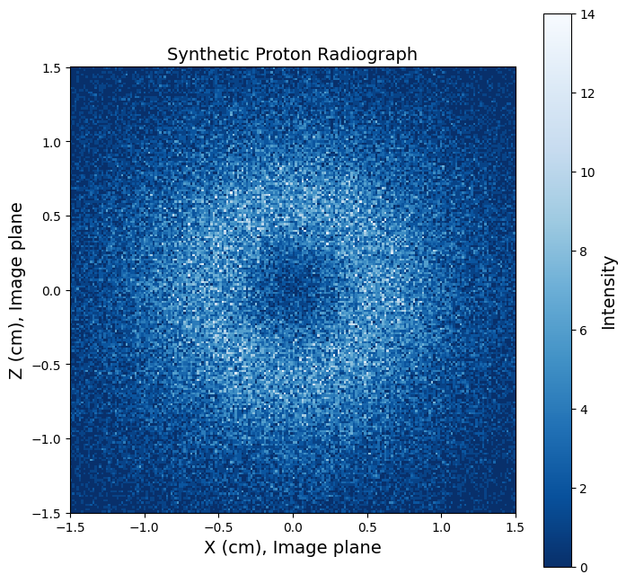

# Abstract

It's like Astropy, but for plasma science! ✨ 🐍

# Most astrophysical fluid is plasma!

{#fig-cme width="75%"}

**Plasma astrophysics is central to CfA science.**
Astronomers often refer to any astrophysical fluid as ["gas,"]{style="color: #a33e00; font-weight: bold;"} regardless of the state of matter.
As distinct states of matter,
[gas]{style="color: #a33e00; font-weight: bold;"} 
and
[plasma]{style="color: #004488; font-weight: bold;"} 
exhibit 
[qualitatively and quantitatively different behavior]{style="color: #009e79; font-weight: bold;"} 
[on both small and large scales]{style="color: #8b2662; font-weight: bold;"}.
[Gas]{style="color: #a33e00; font-weight: bold;"} 
particles interact via binary collisions, while charged particles in 
[plasma]{style="color: #004488; font-weight: bold;"}
exert long-range forces on each other, leading to
[collective behavior]{style="color: #004488; font-weight: bold;"}.
[Gas]{style="color: #a33e00; font-weight: bold;"}
dynamics are unaffected by 
[magnetic fields]{style="color: #b85b00; font-weight: bold;"},
while 
[magnetic fields]{style="color: #b85b00; font-weight: bold;"}
strongly interact with
[plasma]{style="color: #004488; font-weight: bold;"}.
Even a tiny ionization fraction from cosmic rays or photoionization can cause a fluid to behave as a 
[weakly ionized plasma]{style="color: #004488; font-weight: bold;"}.

<!--
*Note: Programming languages like Ruby and Julia have a convention that a function name ending with `!` denotes that the function changes the argument in-place. I advocate spelling "science" as "science!" to denote that doing science! fundamentally changes science!.
-->

# Growing a software ecosystem

**The mission of the PlasmaPy project is to grow an open source software ecosystem for plasma research and education.**
A software ecosystem is a collection of software projects that are developed together and co-evolve in the same environment.
It includes code, documentation, and tests.
A software ecosystem includes educational elements, and it includes community. 
Inspired directly by Astropy and SunPy, PlasmaPy was founded at the CfA — in office P-140.

PlasmaPy is an active participant in the **Python in Heliophysics Community (PyHC)**. 
PyHC facilitates scientific discovery by growing open source Python software and community for solar and space physics, including through packages like SunPy, SpacePy, pySPEDAS, pysat, and PlasmaPy.
In addition to showcasing packages, PyHC's fortnightly meetings often include continuing professional development for research software engineers (RSEs) — activities that would be beneficial to current and future RSEs at the CfA.

# PlasmaPy capabilities

PlasmaPy has many useful capabilities for the astrophysical community.
`Particle` and `ParticleList` provide object-oriented representations of particles.
The `RelativisticBody` class allows straightforward conversion between velocity, the Lorentz factor, energy, and relativistic momentum.
PlasmaPy contains a wide variety of functions to calculate plasma parameters, ranging from `Alfven_speed` and `gyroradius` to dielectric tensor elements and Braginskii transport coefficients.
PlasmaPy's particle tracker was recently revamped and includes non-relativistic and relativistic Boris particle pushers.
PlasmaPy allows the calculation of several types of plasma wave dispersion relations, and well as representations of 1D equilibria.
PlasmaPy's synthetic charged particle radiography and Thomson scattering diagnostic analysis capabilities have been widely used to study laser-produced high energy density plasmas.

::: {#tbl-subpackages tbl-colwidths="[15,85]"}

| Subpackage | Description |
| ---------- | ----------- |
| `particles` | Representations of particles in plasmas |
| `formulary` | Formulae for plasma parameters and transport coefficients |
| `dispersion` | Dispersion relation solvers for plasma waves |
| `simulation` | Contains a particle tracker with a relativistic Boris pusher |
| `diagnostics` | For plasma diagnostics such as Langmuir probes, proton radiography, and Thomson scattering |
| `analysis` | Analysis tools for simulations, experiments, and observations |

PlasmaPy subpackages, described further at `docs.plasmapy.org`.
:::


# Examples

 PlasmaPy's documentation not only describes the how to use functions and classes, but also the underlying physics — in case you ever need to remember what the `Debye_length` and `upper_hybrid_frequency` signify.
 The documentation includes numerous example Jupyter notebooks as educational resources. As an executable research poster, the following beginner examples were run using Quarto, Typst, and Jupyter (see `github.com/namurphy/plasmapy-poster`).

```{python}
from plasmapy.particles import Particle, ParticleList
from plasmapy.formulary import plasma_frequency, RelativisticBody
import astropy.units as u
```

```{python}
proton = Particle("p+")
proton.mass  # interoperable with astropy.units
```

```{python}

helium_ions = ParticleList(["He-4 1+", "α"])
helium_ions.charge
```

```{python}
plasma_frequency(n=0.1*u.cm**-3, particle="e-", to_hz=True)
```

```{python}
p = RelativisticBody("proton", total_energy=1e16*u.eV)
print(f"A proton at {p.total_energy.to('PeV')} has β={p.v_over_c} 🙀")
```

# Laboratory plasma astrophysics diagnostics

Proton radiography involves launching protons through an exploding laser-produced plasma.
Protons get deflected by electromagnetic fields before impacting the detector plane.
Synthetic radiographs constrain the electromagnetic field configuration.

::: {#fig-radiographs layout-ncol=2}




A synthetic proton radiograph of a high energy density plasma (credit: P. Heuer).
:::

**Diagnostics like these allow study of effects such as the Biermann battery** — a proposed mechanism for creating seed magnetic fields in the early universe that later got amplified through dynamo activity.
During one interactive PlasmaPy tutorial, a student managed to create a synthetic proton radiograph that looked like the Death Star (see G. Lucas et al. 1977, 1983).

# Future work

To learn more about our proposed development roadmap, we made our most recent NSF Cyberinfrastructure for Sustained Scientific Innovation proposal available on Zenodo at Murphy et al. (2025, doi: 10.1038/150405d0).

# Acknowledgments

This work has been supported by NSF CSSI award 1931388 and NASA HTM award 80NSSC25K0360.  

**Fun fact:** I grew up north of Canada!


<!-- *Note: We can't use diagnostics like these in astrophysics!* -->

<!-- # Documentation  -->

<!-- # Tests

PlasmaPy has 4745 tests.

*Note: Software testing is the best thing since sliced arrays.* 🔢

 -->


<!-- PlasmaPy's extensive online documentation is at `docs.plasmapy.org` -->

<!-- *Note: An early review of PlasmaPy was from a graduate student here who said: "Your code has documentation."* -->

<!-- # Growing a community of RSEs at the CfA

- A research software engineer (RSE) can be:
  - A scientist who writes software
  - A software engineer who works on research software
  - Everyone in between!
- Term introduced in the 2010s
  - But RSEs pre-date Fortran!
- Challenges for the RSE community
  - Unclear educational & career path
  - Software contributions valued less than publications -->

<!-- # Please cite software — not just software papers

- PlasmaPy’s docs describe how to cite PlasmaPy ✅
- Citing software really helps support projects! 📈 -->
<!-- 
# Starting a CfA RSE exchange?

- CfA projects frequently include code development
- Bring in an RSE is challenging
  - Grants often too small to support a full-time RSE
  - RSEs might be needed for a short time
  - Which RSEs with the needed skills are available?
- An RSE exchange would let CfA scientists and RSEs to find each other for projects and proposals
- Part of a CfA Software & Data Convergence? -->

<!-- # Final thoughts

- Plasma astrophysics is critical to CfA science
- We are growing PlasmaPy as an open source software ecosystem for plasma research and education
- PlasmaPy is interoperable with Astropy and the Python in Heliophysics Community (PyHC)
- The CfA needs RSE professional development for all career and educational stages
  - Create an undergrad/graduate course on RSEing?
- Join `#research-software-engineering` on Slack! -->

<!--
# Also we launched PlasmaPy into space
SD card storing PlasmaPy 0.7.0
Rocket payload, to which the SD card was taped for some reason
Fun fact: I grew up north of Canada!
..>

<!-- 
# References

::: {#refs}
::: -->