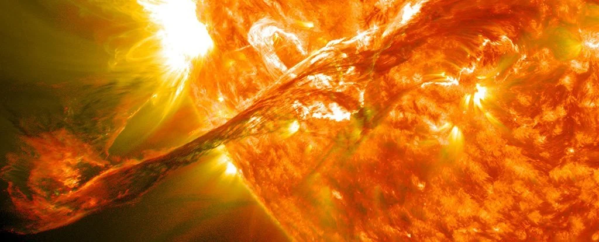
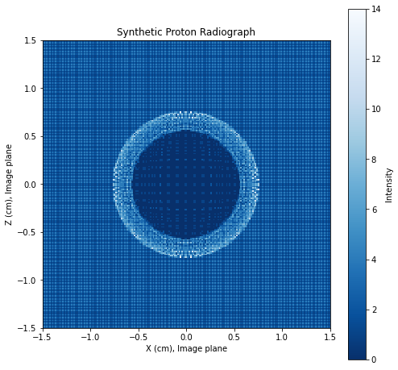

# Abstract

It's like Astropy, but for plasma science! ✨ 🐍

# Most astrophysical fluid is plasma

{#fig-cme width="100%"}

Astronomers often refer to any astrophysical fluid as ["gas,"]{style="color: #962309; font-weight: bold;"} regardless of its state of matter.
However, 
[gas]{style="color: #962309; font-weight: bold;"} 
and 
[plasma]{style="color: #0313d9; font-weight: bold;"} 
exhibit 
[qualitatively and quantitatively different behavior]{style="color: #26a3a9; font-weight: bold;"} 
[on small and large scales]{style="color: #9623c9; font-weight: bold;"}.
[Gas]{style="color: #962309; font-weight: bold;"} 
particles interact via binary collisions, while charged particles in 
[plasma]{style="color: #0313d9; font-weight: bold;"}
exert long-range forces on each other, leading to
[collective behavior]{style="color: #0313d9; font-weight: bold;"}.
[Gas]{style="color: #962309; font-weight: bold;"}
dynamics are unaffected by 
[magnetic fields]{style="color: #cc00cc; font-weight: bold;"},
while 
[magnetic fields]{style="color: #cc00cc; font-weight: bold;"}
strongly affect 
[plasma]{style="color: #0313d9; font-weight: bold;"}.
Even a tiny ionization fraction from cosmic rays or photoionization can cause a fluid to behave as a 
[weakly ionized plasma]{style="color: #0313d9; font-weight: bold;"}.
Hence, plasma astrophysics is crtical to CfA science!

*Note: Programming languages like Ruby and Julia have a convention that a function name ending with `!` denotes that the function changes the argument in-place. I advocate spelling "science" as "science!" to denote that doing science! fundamentally changes science!*

# Growing a software ecosystem

**The mission of PlasmaPy is to grow an open source software ecosystem for plasma research and education.**
A software ecosystem is a collection of software projects that are developed and co-evolve in the same environment.  A software ecosystem includes code, documentation, and tests.
It includes educational elements, and it includes community. 
Inspired directly by Astropy 🌌 and SunPy ☀️, PlasmaPy's first commit was at the CfA in office P-140. ✨

<!-- *Note: more recent commits have happened in P-137.* -->

*Note: Software testing is the best thing since sliced arrays.* 🔢


<!--
To grow an open source software ecosystem for plasma research & education

https://www.plasmapy.org

https://docs.plasmapy.org
-->
<!--
# Building a software ecosystem

- PlasmaPy core package ✨🐍
  - Functionality needed across subdisciplines
  - Interoperability with Astropy
  - Coordination with the Python in Heliophysics Community (PyHC)
- Affiliated packages
  - For more specialized functionality
- Educational resources
  - Jupyter notebook example gallery
- Community
  - Contributor Covenant Code of Conduct
-->

# PlasmaPy subpackages

- `plasmapy.particles`: Object-oriented representations of particles and functions to access particle properties 

- `plasmapy.formulary`: Formulas for commonly needed plasma parameters and transport coefficients 

- `plasmapy.dispersion`: Dispersion relation solvers for plasma waves

- `plasmapy.analysis`: Analysis techniques for data from simulations, experiments, and observations

- `plasmapy.diagnostics`: For plasma diagnostics such as Langmuir probes, proton radiography, and Thomson scattering

- `plasmapy.simulation`: Contains a particle tracker

# PlasmaPy capabilities

- ⚛️ Create Particle and ParticleList objects
- 🧮 Calculate plasma parameters
- 💫 Track particle motions in EM fields
- 🌊 Find plasma wave dispersion relations
- 🌐 Find magnetic null points (prototype)
- 🌡 Calculate thermalization ratio for solar wind plasma
- 📉 Represent plasma equilibria
- 📈 Analyze data from plasma diagnostics (e.g., Langmuir probes and Thomson scattering)
- 💥 Create synthetic proton radiographs

# Example: plasmapy.particles

```         
>>> from plasmapy.particles import Particle, ParticleList
>>> proton = Particle("p+")
>>> proton.mass
<Quantity 1.67262192e-27 kg>
>>> proton.is_category("baryon")
True
>>> helium_ions = ParticleList(["He-4 1+", "α"])
>>> helium_ions.charge
<Quantity [1.60217663e-19, 3.20435327e-19] C>
```

# Laboratory plasma astrophysics

Proton radiography involves launching protons through an exploding laser-produced plasma.
Protons get deflected by electromagnetic fields before impacting the detector plane.
Synthetic radiographs constrain the electromagnetic field configuration.

{#fig-cme width="80%"}

Diagnostics like these allow study of effects such as the Biermann battery — a proposed mechanism for creating seed magnetic fields in the early universe that later get amplified through dynamo activity.

# Documentation 


PlasmaPy's extensive online documentation is at `docs.plasmapy.org`

*Note: one of the earliest reviews of PlasmaPy was from a graduate student here who said, "Your code has documentation."*

# Growing a community of RSEs at the CfA

- A research software engineer (RSE) can be:
  - A scientist who writes software
  - A software engineer who works on research software
  - Everyone in between!
- Term introduced in the 2010s
  - But RSEs pre-date Fortran!
- Challenges for the RSE community
  - Unclear educational & career path
  - Software contributions valued less than publications

# Please cite software — not just software papers

- PlasmaPy’s docs describe how to cite PlasmaPy ✅
- Citing software really helps support projects! 📈

# Starting a CfA RSE exchange?

- CfA projects frequently include code development
- Bring in an RSE is challenging
  - Grants often too small to support a full-time RSE
  - RSEs might be needed for a short time
  - Which RSEs with the needed skills are available?
- An RSE exchange would let CfA scientists and RSEs to find each other for projects and proposals
- Part of a CfA Software & Data Convergence?

# Final thoughts

- Plasma astrophysics is critical to CfA science
- We are growing PlasmaPy as an open source software ecosystem for plasma research and education
- PlasmaPy is interoperable with Astropy and the Python in Heliophysics Community (PyHC)
- The CfA needs RSE professional development for all career and educational stages
  - Create an undergrad/graduate course on RSEing?
- Join `#research-software-engineering` on Slack!

# Also we launched PlasmaPy into space

SD card storing PlasmaPy 0.7.0

Rocket payload, to which the SD card was taped for some reason

Fun fact: I grew up north of Canada!